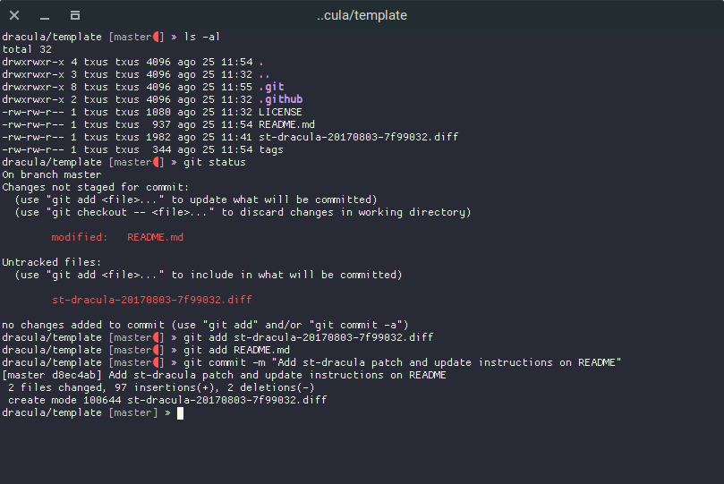

# Dracula for [st](http://st.suckless.org/)

> A dark theme for the simple terminal program [st](http://st.suckless.org/).

## Install

1. Download **st-dracula-20170803-7f99032.diff** and save it anywhere on your computer.

## Activating theme

1. Downlad st source from [the official repository](http://dl.suckless.org/st/).
2. Unzip and navigate to the st directory.
3. `git apply /path/to/the/patch/st-dracula-20170803-7f99032.diff`.
4. Compile st as usual.

## Caveats

Notice that the only way for chaning the colorscheme on st is to recompile it.

## Team

This theme is maintained by the following person(s) and a bunch of [awesome contributors](https://github.com/dracula/template/graphs/contributors).

 

## License

[MIT License](./LICENSE)
